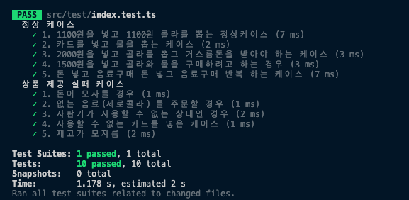

### 설명

- `src/index.ts` 는 vending machine 의 로직이 작성되어 있습니다.
- `src/util.ts` 는 간단한 유틸 함수가 작성되어 있습니다.
- `test/index.test.ts` 에는 정상 케이스 / 상품 제공 실패 케이스에 대한 테스트 코드가 작성되어 있습니다.

### 실행방법

```
yarn
yarn test
```

발생가능한 상황을 아래와 같은 테스트 코드로 작성했습니다.


